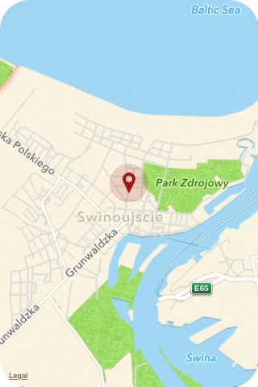
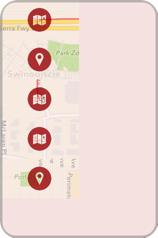
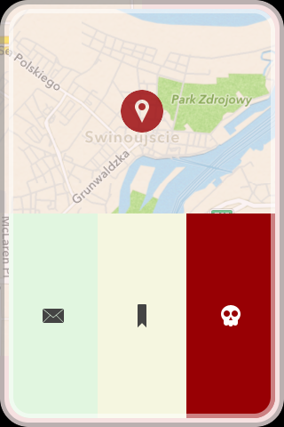

Lokator
=======
Lokator is a simple iOS GeoLogger. 

##Usage
Whole user interface is gesture based:
  * **tap a map twice** to take a snap of your current location,
  * **tap it three times** to start recording changes of your location, 
  * **swipe it left** to zoom map in,
  * **swipe it right** to zoom map out,
  * **swipe it up** to show a drawer with all your logs,
  * **tap an item in a drawer** to show menu and send your log in GPX via mail.

##Screenshots

