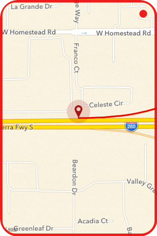
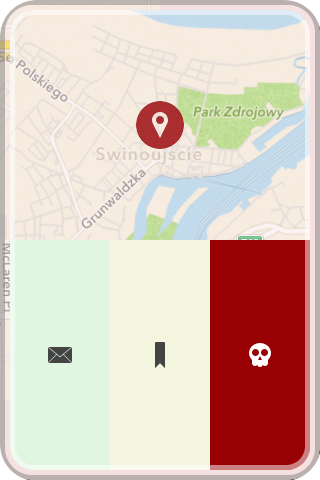

Lokator
=======
Lokator is a simple iOS GeoLogger. 

##Usage
  * Tap a map twice to take a snap of your current location. 
  * Tap it three times to start recording changes of your location. 
  * Swipe it left to zoom map in.
  * Swipe it right to zoom map out.
  * Swipe it up to show a drawer with all your logs.
  * Tap an item in a drawer to show menu and send your log in GPX via mail.

##Screenshots

